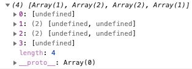

# Outputting Ingredients Dynamically

We take our **first step** towards **outputting** our **ingredients dynamically** by **handling** the **burger ingredients** in the `state` of our `BurgerBuilder`.This is where we will ultimately **edit** the **ingredients** too.

We'll **add** `state` to `BurgerBuilder` as a `property`: `state = {}`

```jsx
// BurgerBuilder.js

class BurgerBuilder extends Component {
  state = {
    ingredients: {
      salad: 1,
      bacon: 1,
      cheese: 2,
      meat: 2
    }
  };
  render() {
    return (
      <Aux>
        <Burger />
        <div>Burger Controls</div>
      </Aux>
    );
  }
}
```

Next we have to get our ingredients. The goal now is to pass an array to our Burger. Somehow we want to give our Burger Component the ingredients. So **on an ingredients property**, we want to **pass** `this.state.ingredients`:

```jsx
<Burger ingredients={this.state.ingredients} />
```

However, the `Burger` does **not receive** any **ingredients** yet. So let's copy the above over to the `Burger Component` and start **outputting the ingredients** **_dynamically_**.

However, we are receiving **ingredients in burger** as `props`, but the **ingredients** in the `state` of the **BurgerBuilder** is an `object`. It's NOT an `array`. We can't use `map` or `loop` through it. So we have to **transform** this **object** into an **array**. We have to transform the object into an array of the values of the ingredients.

Thankfully, to do that is not that difficult. In the burger Component, we'll create a new const which we'll name `transformedIngredients` to make clear that the **result** is **not** the **incoming form**. In the value, we'll use the `JS Object Object` and **attach** the `.keys()` method. It **extracts the keys of a given object and transforms that into an array**. It gives you an array of the keys. So with our ingredients object, the .keys() method would give us the strings of the keys of the ingredients object, but the values would not be a part of the array. We''l pass `props.ingredients` to the .key() method.

```jsx
const burger = props => {
  const transformedIngredients = Object.keys(props.ingredients);
  return (
    <div className={classes.Burger}>
      <BurgerIngredient type="bread-top" />
      <BurgerIngredient type="cheese" />
      <BurgerIngredient type="meat" />
      <BurgerIngredient type="bread-bottom" />
    </div>
  );
};
```

Next we'll `chain` the `.map()` method to `Object.keys(props.ingredients)`. In the .map() function, we want to transform the string value into an array with as many elements as we have ingredients for a given ingredient. So if we have 2 cheese ingredients, then we want transform the cheese string into an array which contains 2 elements. We don't care which elements, just that it has a length of 2. _So we'll return an array, [], and we'll use the spread operator to spread a new array we have to construct , and we'll construct it with the Array() method._

For example, [...Array(3)] will give you and array with three empty spaces basically, with three undefined.

MUST use [...Array()] to construct to a new array, otherwise, without spread operator elements are empty. And we can't do anything with it.

Before using the spread:

```jsx
const transformedIngredient = Object.keys(props.ingredients).map(igKey => {
  return [...Array(props.ingredients[igKey])];
});
console.log(transformedIngredient);
```


After using the spread:

```jsx
const transformedIngredient = Object.keys(props.ingredients).map(igKey => {
  return [...Array(props.ingredients[igKey])];
});
console.log(transformedIngredient);
```



```jsx
// Burger.js

const burger = props => {
  const transformedIngredients = Object.keys(props.ingredients).map(ingKey => {
    return [...Array(props.ingredients[ingKey])];
  });
  return (
    <div className={classes.Burger}>
      <BurgerIngredient type="bread-top" />
      <BurgerIngredient type="cheese" />
      <BurgerIngredient type="meat" />
      <BurgerIngredient type="bread-bottom" />
    </div>
  );
};
```

So we are returning an `array` from `.map()`. The `array length` should be the `amount` of the `given ingredient`. We also access the given ingKey because we are still the function of the .map() method., which runs on an array which contains all our keys. -> Next we **execute map on that Array()** so that we can **map** over the **elements**. We don't care about the element itself. That's why we use `_` as the first arg name to indicate that it's a blank. But the **index**,`i`, IS **important**.

Next, inside of that .map() method, we will return the <BurgerIngredient /> Component because we need to return an array of JSX. There we will **set the key** to `key={ingKey + i}`. ingKey stands for the ingredient, and i the amount (value) of the ingredient. The `type` **property** is simply `type={ingKey}`. **This then means that the ingredients in the BurgerBuilder state have to equal the keys you check for in BurgerIngredient**. They have to have the same casing and the same name. This is important because we are using that to **create the right ingredient** in ``.

`` is what we **return** in the end in the **internal** `.map()` method. Therefore, we **map our object into an array of ingredients** in the end. Ultimately, this is just a way to **transform an object of key value pairs** into **an array of burger ingredients** where the **value of that object is important** for deciding **how many ingredients** we need, and the **key is important for which TYPE of ingredient** we need.

**Now we have our transformed ingredients, so it's time to return them.** So instead of placing

```jsx
<BurgerIngredient type="cheese"/>
<BurgerIngredient type="meat"/>
```

between

```jsx
<BurgerIngredient type="bread-top"/>
<BurgerIngredient type="cheese"/>
<BurgerIngredient type="meat"/>
<BurgerIngredient type="bread-bottom"/>
```

we do the following:

```jsx
{
  transformedIngredients;
}
```

We interpolate the `transformedIngredients` **const**.

```jsx
// Burger.js

import React from 'react';
import classes from './Burger.css';
import BurgerIngredient from './BurgerIngredient/BurgerIngredient';

const burger = props => {
  const transformedIngredients = Object.keys(props.ingredients).map(ingKey => {
    return [...Array(props.ingredients[ingKey])].map((_, i) => {
      return <BurgerIngredient key={ingKey + i} type={ingKey} />;
    });
  });
  return (
    <div className={classes.Burger}>
      <BurgerIngredient type="bread-top" />
      {transformedIngredients}
      <BurgerIngredient type="bread-bottom" />
    </div>
  );
};

export default burger;
```
