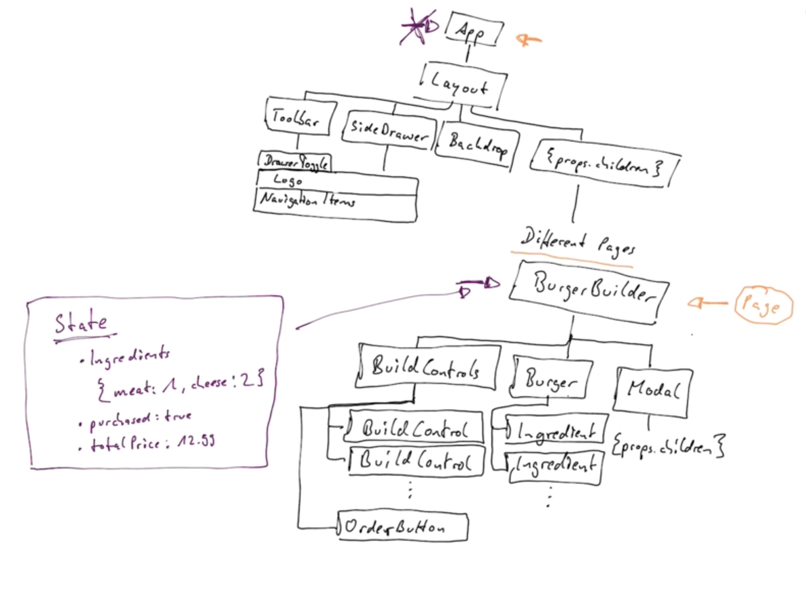

## Planning The Burger React App

1. **Component Tree / Component Structure**
2. **Application State (Data)**
3. **Components vs Containers**
   - Plan for Stateful vs Presentational Components
   - Container file will normally connect to redux later

#### <u>Burger Builder</u>

Use this Burger Builder to build your own burger with different ingredients.

#### Root Layout

- **App** component, a base layout for this app which basically would be the header and the body.

- **Layout** component, has a couple of other components nested besides it, some component respontive for _navigation_ and for the _content_, so the navigation on the other hand might be split up in a **tool bar** and a **sideDrawer**. so we have cater for both mobile devices and desktop devices.
  - **Toolbar**, displayed and the items we display on it varies by the viewport.
  - **sideDrawer**, simply the side menu we can bring in when we're on the mobile.
  - **Backdrop**, in case we want to show a modal for the checkout. Also a backdrop on the root level of out DOM.
  - **{props.children}** Something we can dynamically wrap, whichever page you want to display. later in the app, we're going to add Routing, to navigate to different pages. So we might want to display the burger builder page or the checkout page but all pages are going to share that layout. So {props.children} is essential here to allow us to dynamically pass a component in too depending on which page we want to do. This {props.children} just as a dynamic component which we nest into out layout. 

#### Planning the State

This state is important because it allows us to identify what should be a component and what should be a container. What should be a stateless component and what should be a stateful component.

**<u>State:</u>**

- Ingredients
  - Eg. {meat:1, cheese:2}
- Purchased: true
- totalPrice: \$18

So the _burger builder_ should be a **stateful** component, it should be a **container**. All other components can be dumb components (stateless components).

## Setting up the Project

This project was bootstrapped with [Create React App](https://github.com/facebook/create-react-app).

##### Fonts

Using Google fonts - Open Sans (Regular 400 & Bold 700)

Create two folders:

- Components:
  1. Layout folder:
     - Layout.jsx
  2. Burger folder:
     1. BurgerIngredient folder:
        1. BurgerIngredient.jsx
- Containers:
  - BurgerBuilder folder:
    - BurgerBuilder.jsx

Then create a high order components folder:

- hoc folder:
  - Aux.jsx

#### DynamicIngredients

[DynamicIngredients](./DynamicIngredients.md)
